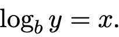

# Mathematical Preliminaries

1. Estimation is not mathematical technique. It is engineering skil.

---

## Sets and Relations

- Set: 집합 (구별 가능한 element/member 모임)
  - 중복 불가
- P 라는 set 있을 때 7, 11, 100 이 있으면 element 는 7, 11, 100 이고 base type 은 integer

---

### Set Notation

- 

---

- Set 은 순서가 정해지지 않음
- Powerset 은 한 set 가 있을 때 모든 가능한 subsets 를 의미함 {1, 2}

  - {공집합, {1}, {2}, {1,2}}

---

- 중복된 값이 들어가는 것은 bag 이라고하고 multiset 이라고도 불림, [] 로 표현됨
- [3, 4, 5, 4] 와 [3, 4, 5] 는 다름
  - {3, 4, 5} 와 {4, 5, 3} 은 같음
  - [3, 4, 5, 4] 와 [3, 4, 4, 5] 는 같음 (순서가 없음)

---

- Sequence 는 순서가 있고 중복도 가능함
  - tuple 이나 vector 라고 불림
  - 0 부터 시작
  - <> 로 표현
  - <3,4,5,4> != <3,4,4,5>

---

- Relation R: set 의 ordered paris 를 나타냄

  - {a, b, c}
  - e.g. {<a, c>, <b, c>, <c, b>}
  - e.g. {<a, a>, <a, c>, <b, b>, <b, c>, <c, c>}
  - 위 두 개는 다른 relation
  - infix notation: xRy <x, y>
    - 일반적으로 x < y 가 되야됨
    - 1, 3: true
    - 2, 2: false
  - binary relation 은 아래조건을 따름
    

  - symmetric and transitive 하면 is a sibling of.
  - a sibling 으로 정의하면 it is reflexive, not a sibling 으로 하면 it is not reflexive.
  - equivalence relation 은 reflexive, symmetric, transitive.
  - binary relation 은 partial order 라고 뿔린다 if it is antisymmetric and trasitive.
  - 여기까지만. ㅎㅎ..

---

## Miscellaneous Notation

- B: bytes
- b: bits
- KB: kilobytes 2^10 (요즘은 KiB 가 2^10 kB 는 2^10)
- ms: 1 / 1000 of a second
- n!: factorial 0! = 1, 3! = 1 곱 2 곱 3
- permutation: S 의 members. sequence. sequence 가 n distinct 를 가지고있으면 n! 경우의 수가 나옴
- approximately equal: ≈
- boolean variable: true(1), false(0) 실제로는 숫자로 표현하면 안됨 (연관만 됨)
- Logic notation:
  - A ⇒ B means “A implies B” or IF A then B
  - A ⇔ B means "A if and only if B" or "A is equivalent to B"
  - A ∨ B means “A or B"
  - A ∧ B means "A and B"
  - ∼A and A both mean “not A” or the negation of A where A is boolean variable
- Floor and ceiling
  - floor of x 
  - ceiling of x 
- Modules operator: % 사용

---

## Logarithms

- base 'b' for value 'y' is the power to which b is raised to get y.
  - 
- if base is not written, base is 2 in this book.
- loarhitms' properties: 

---

## Summations and Recurrences

- summation: sigma
  - 
  - 
- closed-form solution: it can represent algebraic equation.
  - 
- recurrence: 
  - it can be represented by closed-form.

---

## Recursion

- recursive: call to itself
- two parts: base case, the recursive part
  - recursive part has the parameter which is closer to the base case the those of the original call.
- 
- some recursions 은 only iteration 으로 구현하기 어렵다.
  - towers of Hanoi
    - A 에서 C 로 옮기는 것이 목표
    - N - 1 개를 B 에 놓고 마지막 것을 C 에 놓는 방식으로 구현
    - 디테일한 동작은 생각할 필요 X
    - 
- devide and conquer: subproblems 로 분리하는 방식

---

## Mathematical Proof Techniques

- 왜 좋은지 boss 에게 설명하기 위함
- 증명 방법
  - direct proof/deduction(추론)
  - proof by contradiction(모순)
  - proof by mathematical induction(유도)

---

### Direct proof

- directr proof: logical explanation
- P, Q 가 같다는 것을 증명하고 싶다면 P => Q, Q => P 를 확인

---

### Proof by Contradiction

- find a counterexample

### Proof by Mathematical Induction

1. base case
2. inductions step

---

## Estimation

- it is no substitute for rigorous.
- 대충 분석하다 아니다 싶으면 버릴 수 있음

1. 많이 사용할 파라매터의 영향에 대해 알아봄
2. equation 을 알아봄
3. 적절한지 확인

---

- 재귀 문제: https://www.acmicpc.net/problem/1914
- 스택 문제: https://www.acmicpc.net/problem/9012
- 큐 문제: https://www.acmicpc.net/problem/1966
